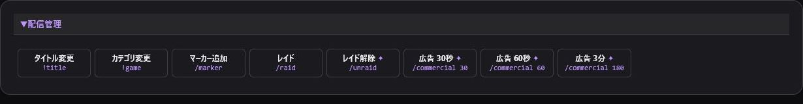
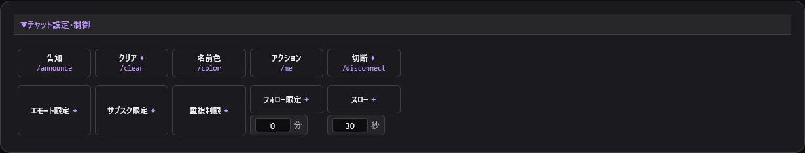
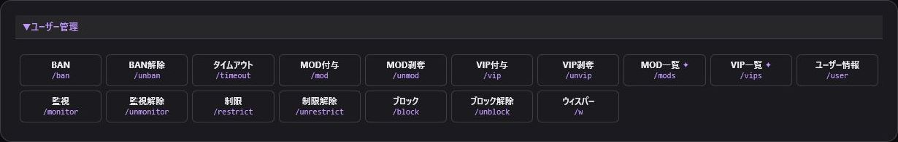
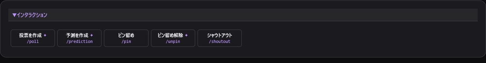

> 🌐 **Language / 語言:** **🇯🇵 日本語** | [🇺🇸 English](Commands-EN) | [🇨🇳 简体中文](Commands-ZH)

---

# コマンド

配信中によく使うTwitchコマンドをカテゴリ別にまとめています。

- ✦付き: Twitchへ直接実行
- それ以外: コマンドをコピーし、IDや本文を追記してチャットへ送信

直接実行にはTwitch認証と対応する権限（Scope）が必要です。

## 配信管理

タイトル、カテゴリ、マーカー、レイド、広告を操作します。レイド先へのURL案内も自動で送りたい場合は、[通知と紹介](Raid-and-Notifications)の`/raid`ボタンを使います。

## チャット設定

告知、クリア、チャットモード、フォロー限定、スローモードを操作します。

## ユーザー管理

BAN、タイムアウト、MOD、VIP、監視、制限、ブロック、ウィスパーを操作します。

## インタラクション

投票、予測、ピン留め、Shoutoutを操作します。詳細な予測・投票は[Twitch](Twitch-Tools)、紹介文は[通知と紹介](Raid-and-Notifications)を使います。

> BAN、レイド、広告、権限変更は実行前に対象と内容を確認してください。レイド開始には`channel:manage:raids`権限が必要です。
