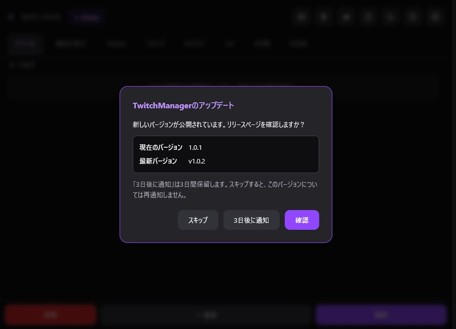

> 🌐 **Language / 語言:** **🇯🇵 日本語** | [🇺🇸 English](Getting-Started-EN) | [🇨🇳 简体中文](Getting-Started-ZH)

---

# インストールとOBSへの追加

## インストール

### Windows 11

1. [GitHubの最新リリース](https://github.com/MagnestGames/TwitchManager/releases/latest)を開きます。
2. Assetsから`TwitchManager-Windows11-Setup.exe`をダウンロードして実行します。
3. インストールを完了します。

既定のインストール先は、Windowsの「ドキュメント」フォルダ内にある`TwitchManager`です。

### macOS

1. [GitHubの最新リリース](https://github.com/MagnestGames/TwitchManager/releases/latest)を開きます。
2. `TwitchManager-macOS.pkg`をダウンロードしてインストールします。

既定のインストール先は`/Applications/TwitchManager`です。対応環境はmacOS 11以降です。

## アップデート通知

TwitchManagerは起動時に最新の安定版を確認します。新しいバージョンがある場合は、現在の版と最新の版を表示するダイアログが開きます。

- 「確認」: GitHubの対象リリースページを開きます。
- 「3日後に通知」: 3日間保留し、期限後に同じ更新を再び通知します。
- 「スキップ」: そのバージョンについては再通知しません。さらに新しい版が公開された場合は再び通知します。

確認は最大でも24時間に1回です。beta版では通知を表示しません。通信できない場合も通常どおり起動し、エラーダイアログは表示しません。更新前に「その他」タブからバックアップを作成してください。

## OBSへ追加する

1. OBS Studioの「ドック」から「カスタムブラウザドック」を開きます。

2. ドック名に`TwitchManager`と入力します。

3. URL欄にOBS用URLを貼り付けます。URLは次のいずれかの方法で取得できます。

   - Windowsでは、インストール完了時にコピーされたURL、または`OBS_Dock_URL.txt`に記載されたURLを使用します。
   - `TwitchManagerDock.html`をブラウザで開き、アドレスバーに表示されたURLをコピーします。

4. 「適用」を押します。

5. 追加されたドックをドラッグして配置し、文字やボタンが読める幅に調整します。

6. 右上の歯車から[Twitch認証](Authentication)を設定します。

> ZIP版を使用する場合は、HTMLファイルだけを取り出さず、同梱ファイルを同じフォルダ構成のまま配置してください。
