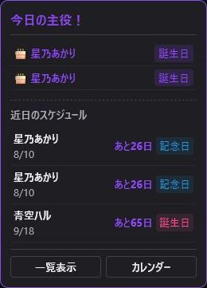
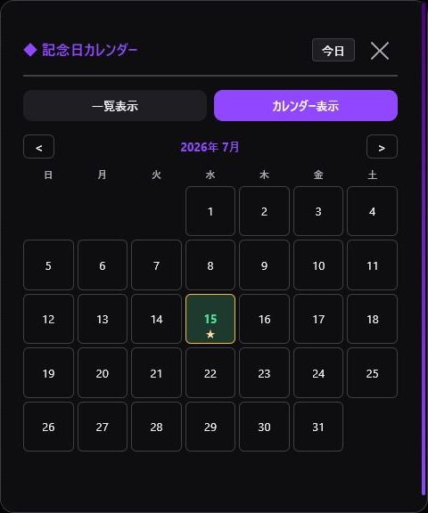

> 🌐 **Language / 語言:** **🇯🇵 日本語** | [🇺🇸 English](ID-List-EN) | [🇨🇳 简体中文](ID-List-ZH)

---

# IDリスト

コラボ相手やレイド先候補の情報をカードで管理します。

## 登録できる情報

- 表示名、Twitch ID
- X、YouTube
- メモ
- 誕生日、記念日
- タグ・グループ
- 紹介回数と最終紹介日時

「＋ 追加」でカードまたはグループを作成します。同じ配信者を複数のグループへ登録でき、上部のタグから絞り込めます。

並び順は、名前、グループ、直近の紹介、紹介回数、誕生日から選べます。Twitch IDは表示名ではなくログインIDで揃えてください。

## 誕生日・記念日

登録した日付は、画面上部の通知とカレンダーに表示されます。

IDリストは定期的に[バックアップ](Settings-and-Backup)してください。
