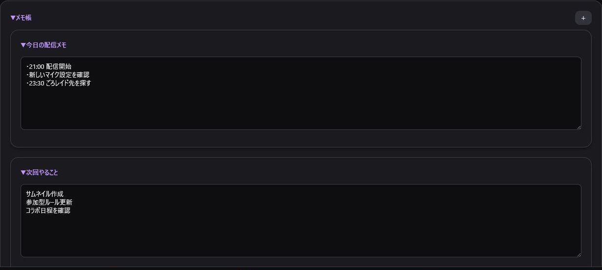

> 🌐 **Language / 語言:** [🇯🇵 日本語](Memo-and-Other) | **🇺🇸 English** | [🇨🇳 简体中文](Memo-and-Other-ZH)

---

# Memo Pad & Utilities

## Memo Pad

Save talking points, stream schedules, and notes across multiple cards.

Click **"+"** to add cards. Reorder cards while unlocked. Use delete mode to clean up unused notes.

Use Cases:
- Topic ideas to mention during stream
- Event schedule and rundown
- Collab stream checklists
- Tasks for the next stream

## Backup & Restore

- **Backup**: Copy your app data or download it as a text/JSON file.
- **Restore**: Load a backup JSON file to overwrite or merge with existing settings.

*Always save a fresh backup before performing a restore.*

## Event Logs

View operation logs for authentication, notifications, raid shoutouts, and command executions. When sharing logs for troubleshooting, ensure no personal tokens or sensitive information are exposed.
