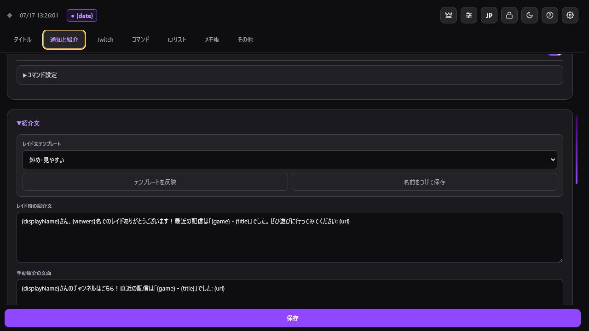
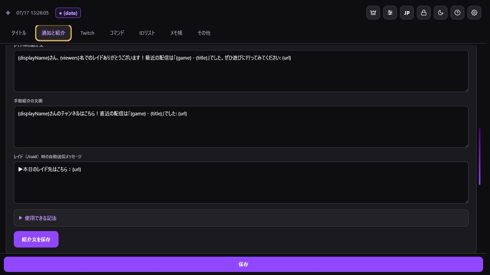
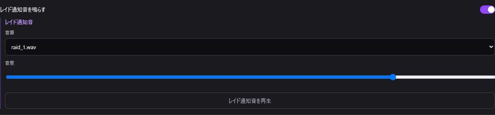

> 🌐 **Language / 語言:** [🇯🇵 日本語](Raid-and-Notifications) | **🇺🇸 English** | [🇨🇳 简体中文](Raid-and-Notifications-ZH)

---

# Alerts & Raids

Under the **"Alerts & Raids"** tab, you can configure channel shoutouts, automatic raid handling, shoutout templates, and sound alerts.

## Manual Shoutouts & Raid Launch

Enter a Twitch ID or channel URL to trigger the following actions:

- `/shoutout`: Send Twitch's official channel shoutout.
- `/raid`: Initiate a raid to the specified channel.
- **"Send Shoutout Message"**: Send your saved custom shoutout template to chat.

Streamers registered in your ID List will appear as auto-complete suggestions. Always double-check the target Twitch ID before clicking `/raid`.

## Automatic Raid Shoutout

- Automatically send a shoutout message after receiving an incoming raid.
- Set a delay timer (0 to 600 seconds) before sending.
- Simultaneously trigger Twitch's official `/shoutout`.
- Automatically post the target channel's URL to chat when you manually execute `/raid`.
- Allow chat commands (e.g., `!so`) to trigger shoutout messages.
- Restrict command permissions (Broadcaster, Moderators, VIPs, Subscribers, Everyone).

## Shoutout Templates

You can save separate templates for incoming raids, manual shoutouts, and outgoing raids. The outgoing raid template is used when sharing the destination channel's URL in chat after launching a raid.

| Variable | Description |
| --- | --- |
| `{displayName}` | Target's Display Name |
| `{username}` | Target's Twitch ID |
| `{viewers}` | Raid Viewer Count |
| `{url}` | Target Channel URL |
| `{game}` | Target's Last Played Category |
| `{title}` | Target's Last Stream Title |

In outgoing raid templates, `{url}` is replaced with the raided channel's URL.

## Raid Reception Settings

Copy the settings URL from **"Twitch Raid Reception Settings"**, then open it in your computer's default browser. If Twitch asks you to sign in, you can continue in the browser you normally use.

## Sound Alerts

Configure the sound toggle, audio file, and volume for raids, chat messages, Channel Point redemptions, and first-time chat messages. By default, sounds play from TwitchManager. When OBS output is enabled, all alert audio is routed through a single OBS Browser Source.

### External Sound Folder Setup

1. Click **"Select Sound Folder"**.
2. Pick the folder containing your audio files.
3. Select sound files for each event, preview, and save.

*Recommended formats: `.wav` or `.mp3`. Due to browser security policies, you may need to re-select the folder after reloading the page or restarting OBS.*

To mute alerts for bot accounts, register their Twitch IDs under **"Muted Users"**.

### 🔊 Route sounds to OBS

1. Open **"🔊 Route sounds to OBS"** under Sound Alerts.
2. Copy the displayed Browser Source URL.
3. Add one Browser Source in OBS and paste the URL.
4. Enable **"Play notification sounds from the OBS Browser Source"**.
5. Preview a sound and confirm that it reaches the OBS Audio Mixer only once.

When enabled, sounds play through the OBS Browser Source. When disabled, they play from TwitchManager. Adding the same source more than once, or capturing monitored audio again as Desktop Audio, can cause duplicate playback.

### Welcome Notification

Open the fox icon in the **"🔊 Route sounds to OBS"** guide to enable Welcome Notification. Once enabled, fields for a Twitch ID and notification sound appear below the sound settings.

Enter a Twitch ID, login name, or channel URL. IDs from raid shoutouts and other history are available as suggestions. When a selected viewer appears in the stream's chat participant list, TwitchManager plays the chosen sound once per stream—even if they have not posted a message.

> Detection can take a few minutes after the viewer joins.

> This is a playful extra. Because it may reveal that someone is watching without chatting, use it with care and consider the viewer and the tone of your stream.
