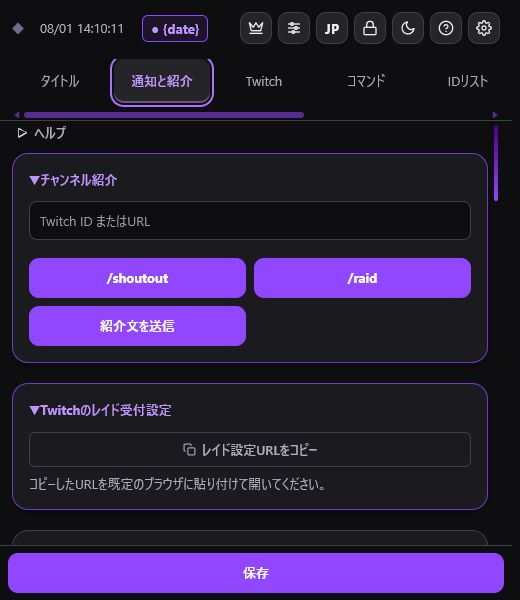
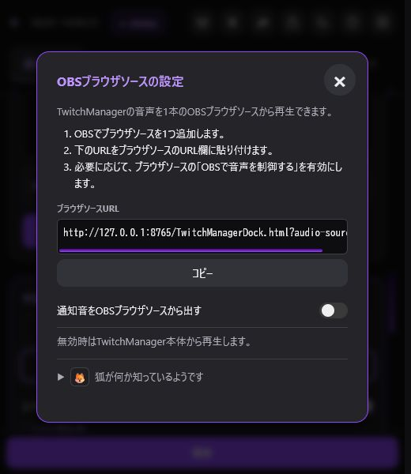
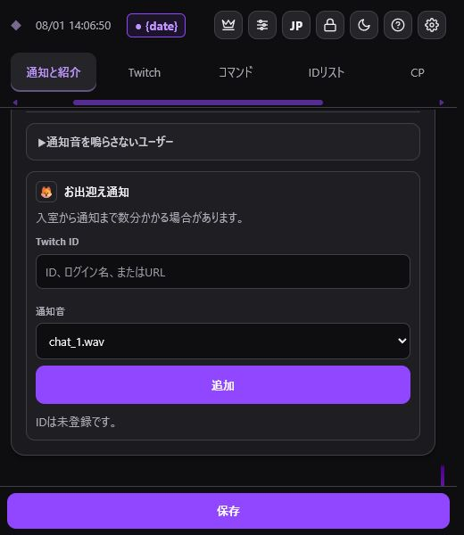

> 🌐 **Language / 語言:** **🇯🇵 日本語** | [🇺🇸 English](Raid-and-Notifications-EN) | [🇨🇳 简体中文](Raid-and-Notifications-ZH)

---

# 通知と紹介

「通知と紹介」タブでは、チャンネル紹介、レイド時の自動処理、紹介文、通知音を設定します。

## 手動紹介・レイド開始

Twitch IDまたはチャンネルURLを入力し、次の操作を行います。

- `/shoutout`: 公式のチャンネル紹介を実行
- `/raid`: 入力したチャンネルへのレイドを開始
- 「紹介文を送信」: 保存した手動紹介文をチャットへ送信

IDリストに登録済みの配信者は入力候補に表示されます。`/raid`を押す前に、入力したTwitch IDと配信先を必ず確認してください。

## 自動レイド紹介

- レイド受信後に紹介文を自動送信
- 送信までの待ち時間を0～600秒で指定
- 公式のチャンネル紹介（`/shoutout`）を同時実行
- 手動で`/raid`を実行したとき、レイド先URLをチャットへ自動送信
- 指定コマンドから紹介文を送信
- コマンド利用者を配信者、モデレーター、VIP、サブスクライバー、全員から選択

## 紹介文

受信レイド用、手動紹介用、送信レイド用の文面を別々に保存できます。送信レイド用の文面は、`/raid`実行後にレイド先URLを案内するときに使います。

| 記法 | 内容 |
| --- | --- |
| {displayName} | 表示名 |
| {username} | Twitch ID |
| {viewers} | レイド人数 |
| {url} | チャンネルURL |
| {game} | 直近のカテゴリ |
| {title} | 直近のタイトル |

送信レイド用の文面では`{url}`がレイド先のチャンネルURLに置き換わります。

## レイド受付設定

「Twitchのレイド受付設定」から設定URLをコピーし、PCの既定のブラウザで開きます。Twitchへのログインが必要な場合も、普段使っているブラウザでそのまま認証できます。

## 通知音

レイド、コメント、ポイント引き換え、初回コメントごとに、オン・オフ、音源、音量を設定します。「OBSへ通知音をまとめる」が無効な場合は、TwitchManager本体から再生します。

### 外部サウンドフォルダ

1. 「音声フォルダを選択」を押します。
2. 音源が入ったフォルダを選びます。
3. 各通知の音源を選び、試聴して保存します。

推奨形式はwavまたはmp3です。ページの再読み込みやOBS再起動後は、ブラウザの制限により同じフォルダを再選択する必要があります。

自動応答用アカウントなどへ通知音を鳴らしたくない場合は、「通知音を鳴らさないユーザー」にTwitchログインIDを登録します。

### 🔊 OBSへ通知音をまとめる

TwitchManagerの音声を、1本のOBSブラウザソースから再生できます。通知ごとに別々のソースを作る必要はありません。

1. 通知音設定の「🔊 OBSへ通知音をまとめる」を開きます。
2. 表示されたブラウザソースURLをコピーします。
3. OBSでブラウザソースを1つ追加し、コピーしたURLを貼り付けます。
4. 「通知音をOBSブラウザソースから出す」を有効にします。
5. 通知音を試聴し、OBSの音声ミキサーへ1回だけ入力されることを確認します。

有効時はOBSブラウザソースから、無効時はTwitchManager本体から再生します。OBS側で配信者自身も音を聞く場合は、音声モニタリングを必要に応じて設定してください。同じブラウザソースを複数追加したり、OBSのモニタリング音声をデスクトップ音声でも取り込んだりすると、二重に聞こえる場合があります。

### お出迎え通知

「🔊 OBSへ通知音をまとめる」の説明画面にある狐アイコンを押すと、「お出迎え通知」を有効にできます。有効にすると、通知音設定の下部へTwitch IDと通知音の登録欄が表示されます。

1. 「お出迎え通知」を有効にします。
2. Twitch ID、ログイン名、またはチャンネルURLを入力します。レイド紹介などの履歴にあるIDは候補から選べます。
3. 通知音を選び、「追加」を押します。

指定したリスナーが配信のチャット参加者一覧に現れると、コメントをしていなくても、その配信で一度だけ通知音を鳴らします。配信開始時からチャット参加者一覧にいるリスナーには、開始直後の誤通知を避けるため鳴らしません。一度鳴ったリスナーが退出して戻っても、同じ配信では再び鳴りません。

> 参加者一覧を定期的に確認するため、入室から通知まで数分かかる場合があります。

> 遊び心のある機能です。相手がコメントせずに視聴していることが分かる場合があるため、配信の雰囲気や相手との関係に合わせてご利用ください。
