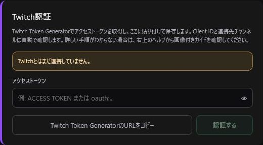
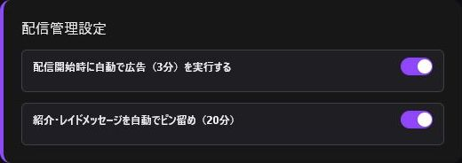
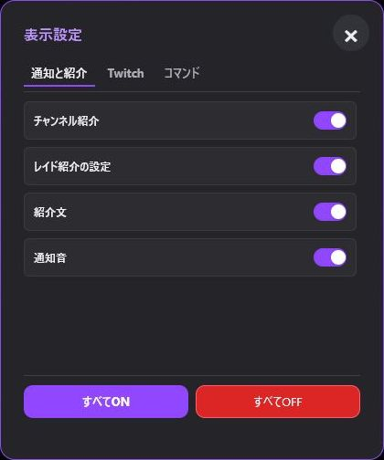

> 🌐 **Language / 语言:** [🇯🇵 日本語](Settings-and-Backup) | [🇺🇸 English](Settings-and-Backup-EN) | **🇨🇳 简体中文**

---

# 设置与备份

点击右上角的齿轮图标以微调通用设置。

## Twitch 身份验证

可保存 Token、确认已关联的账号信息或解除授权。详细说明请参阅 [Twitch 身份验证](Authentication-ZH)。

## 显示设置

自定义日期格式、文字大小与行高。日期格式会同步应用至顶部状态列与模板变量 `{date}`。

## 直播自动化设置

- 开播时自动播放 3 分钟广告。
- 自动将介绍与 Raid 消息在聊天室钉选 20 分钟。

*自动广告默认为关闭。请仅在需要时启用，并确认不会与 Twitch 官方的定时广告设置重叠。*

## 选项卡与功能区显示设置

可设置显示或隐藏“通知与介绍”“Twitch”和“指令”选项卡中的功能区。隐藏功能区不会删除任何已保存的数据。

## 数据备份

可使用“其他”选项卡中的“复制备份”导出数据。请务必在更新 OBS、更换电脑、清理浏览器缓存或执行恢复前创建备份。

数据保存在 OBS 或浏览器的本地存储中。如果普通浏览器与 OBS Dock 的内容不一致，请先从一端导出备份，再在另一端恢复。
