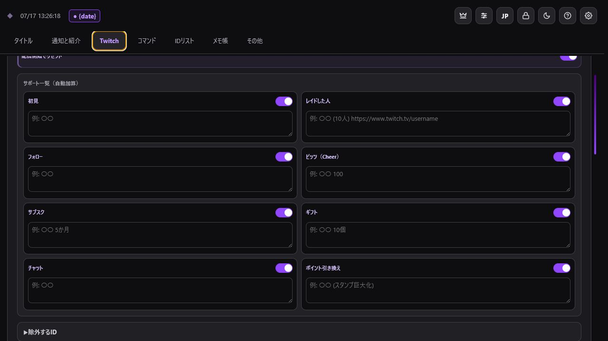
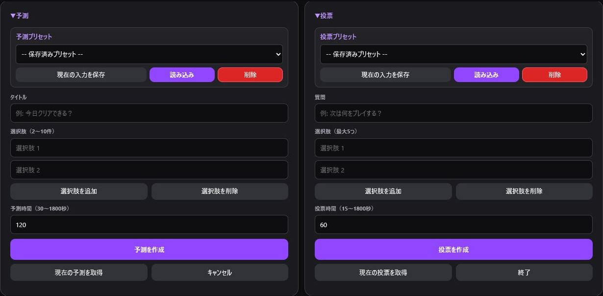
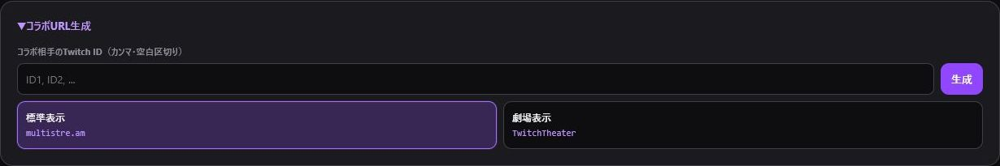
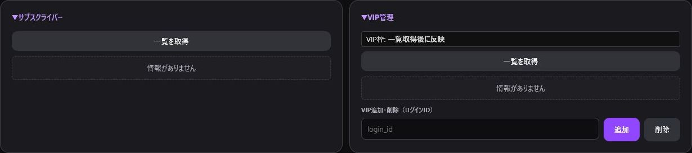

> 🌐 **Language / 語言:** [🇯🇵 日本語](Twitch-Tools) | **🇺🇸 English** | [🇨🇳 简体中文](Twitch-Tools-ZH)

---

# Twitch Integration Features

The **"Twitch"** tab provides tools for managing Twitch interactions during and after your stream.

## Supporter List & Summary

Tracks first-time chatters, incoming raids, new followers, Bits cheers, subscriptions, sub gifts, chat activity, and Channel Point redemptions. Allows copying a formatted thank-you summary with one click.

Channel Point redemptions log custom rewards as well as Twitch automatic rewards (Gigantify Emotes, Message Effects, Celebrations, Highlighted Messages). Bits used via Power-ups are also calculated into the Bits total.

You can exclude unwanted categories or bot accounts and configure automatic list resets when your stream starts. Past logs can be accessed via **"Open Past Logs"**.

## Predictions & Polls

- **Predictions**: 2 to 10 options, duration 30 to 1800 seconds.
- **Polls**: Up to 5 options, duration 15 to 1800 seconds.
- Support for creation, status fetching, resolution/ending, and saving presets.

## Chat Control Settings

Easily toggle chat modes: Clear Chat, Emote-Only, Subscribers-Only, Unique Chat (r9k), Followers-Only, and Slow Mode.

## API Tools & Clips

Create stream markers and send chat announcements. Clips can be created, fetched, and saved to your favorites.

## Collab Multi-stream URLs

Generate multi-view URLs (`multistre.am` or `TwitchTheater`) using multiple Twitch IDs.

## Subscribers & VIPs

Fetch subscriber list. View VIP lists and slot usage, and add or remove VIPs by entering Twitch login IDs.

*Each feature requires specific permissions (Scopes). If an operation fails, check your [Twitch Authentication](Authentication-EN) and event logs.*
